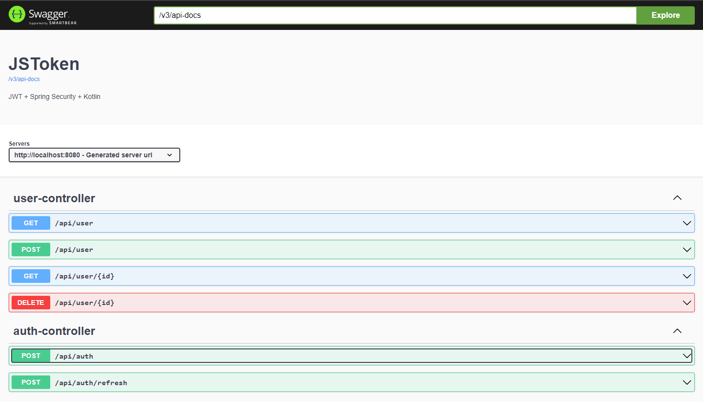
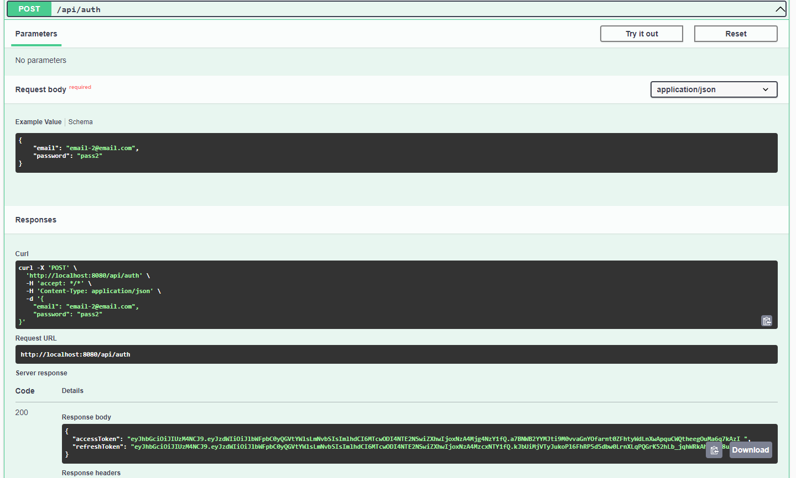

<h1 align="center">JWT - Tokens</h1>

 🚀 Kotlin com Spring

<h1 align="center"></h1>

•
 <a href="#objetivo">Objetivo</a> •
 <a href="#tecnologias">Tecnologias</a> • 
 <a href="#autor">Autor</a> •

<h1 align="center">
    
    

</h1>

## **Objetivo**

 🔍 Treinando aplicação com Kotlin, Spring Security 6, JWT e Swagger. Possui sistema de autenticação, autorização e refresh de accessToken. 

## **Tecnologias**

<ul> ⚙️ Tecnologias
    <li>🛠 Kotlin
    <li>🛠 Spring Security
    <li>🛠 JWT
    <li>🛠 Spring Framework

</ul>

## **Autor**

 Desenvolvido por <a href="https://github.com/valtercfjunior">Valter Junior</a>

****